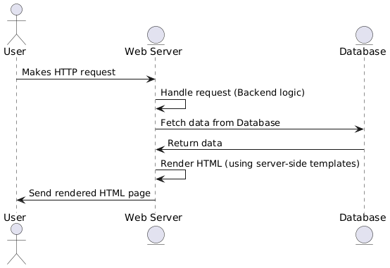
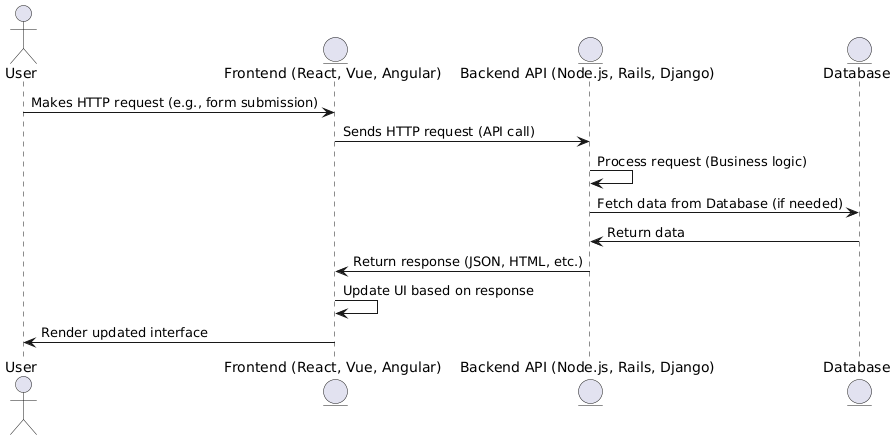

# DíaMayor Innova

<div align="center">
  <h2 align="center">DíaMayor</h2>
  
</div>
<br />
The project involves the development, by the students of IES El Rincón, of a cross-platform application that will assist students in the Professional Family of Administration and Management with the modules TEB, TUM, EPE, PNG, and COB in carrying out accounting entries. The application will allow the implementation of aids related to accounting accounts, as well as practical examples based on the proposed activities, which will serve as a guide and support in the learning process. The starting point is the spreadsheet created by the project coordinator. The project aims to create an application that will replace this spreadsheet, enabling its functionality on any mobile device, tablet, or PC.

## About The Project 📖

The application to be developed aims to be an easy-to-use learning tool for both students and teachers. It should work on mobile devices, tablets, and PCs. There will be three modes of use:

* **Exam Mode**: The student completes the task without any additional aids.
* **Learning Mode**: A mode for learning, where aids are provided.
* **Exercise Mode**: Similar to Exam Mode, but students can also complete it at home.
Teachers will have the ability to create statements (tasks) and also add solutions for each one. The application should automatically grade the tasks, calculating the corresponding mark. These marks will be accessible to the teachers, who can download them. Additionally, the statements created by the teachers can be set as private (only visible to the creator) or public (available for other teachers to use).

There will be three types of users with different permissions:

* **Administrator (Admin)**: Has full permissions in the application.
* **Teachers**: Can create statements, set them as public or private, and assign tasks (a set of statements) to a group of students within a specified period. They can also view the marks of the students who have completed the tasks.
* **Students**: In Learning Mode, they can perform tasks without these tasks being created on the platform. In Exercise Mode, they can complete tasks assigned by their teacher, view solutions, and save results. In Exam Mode, students will complete tasks without aids, similar to Exercise Mode.
The application will also manage student groups so that teachers can view and manage the tasks for each group.

Support for multiple school centers can be added, although it is not a priority, to identify which center each student and teacher belongs to.

In the Diary tab, accounting entries will be managed, which are related to the statements. A statement generally corresponds to an entry, although there may be cases where a statement involves multiple entries. Additionally, an entry may have several accounting postings, and although the order of the postings may vary, the solution remains valid. In some cases, the same statement may have more than one solution, in which case the teacher must enter all possible solutions.

In the Ledger tab, a dynamic table will be automatically generated based on the data from the Diary.

In the Trial Balance tab, the data will also be automatically calculated from the information in the Diary.

The PGC tab will be used to access the General Accounting Plan, particularly the PGC for SMEs. There will be five types of accounting plans provided in Excel format by IES Santa Brígida. Each accounting plan has five columns: account number, account definition, debit reasons, credit reasons, and the type of account (asset, liability, income, or expense). Additionally, teachers can activate or deactivate aids (examples of how to use the accounts) in this tab, and these aids will be available to students while working on the accounting entries in the Diary tab.

This set of features forms an integrated application designed to facilitate learning in accounting with support for task creation, automatic grading, and result management.

<p align="right">(<a href="#díamayor-innova">back to top</a>)</p>
## Approaches to Web Architecture Design: Monolithic vs. Decoupled 🔄

### Separate Frontend and Backend (Decoupled)

This architecture is commonly referred to as client-server architecture, and when discussing modern applications, it is often associated with the concept of a Single Page Application (SPA) for the frontend.

* **Frontend**:  The frontend is responsible for the user interface and user interaction. It is typically developed using technologies like React, Vue.js, Angular, etc., and interacts with APIs (usually REST) to fetch and send data to the backend.
* **Backedn**: The backend handles business logic, database management, authentication, authorization, etc. It is typically developed using frameworks such as Node.js, Ruby on Rails, Django, Flask, Spring Boot, etc. The backend provides the APIs that the frontend consumes.

**Example Flow**

* The frontend makes an HTTP request to the backend API.
* The backend processes the request, performs database operations if needed, and returns the response to the frontend.
* The frontend receives the response and updates the user interface as necessary.
<div align="center">
  
</div>

### Non-Separated Frontend and Backend (Monolithic)

The frontend and backend are integrated into a single application.

* **Frontend**: The frontend code is served directly from the same server as the backend. It may be written in traditional HTML, CSS, and JavaScript, and typically uses server-side templates to render views (for example, in Ruby on Rails, Django, or Laravel).
* **Backend**: The backend is also responsible for rendering views and handling business logic, authentication, and the database, but everything is within the same server and context.

**Example Flow**

* The server receives an HTTP request from the client.
* The server processes the request, handles business logic, and responds with the rendered HTML page along with the data.
* There is no clear separation between the frontend and backend; both are handled within the same execution flow.
<div align="center">
  
</div>

### Comparison: Ruby on Rails + ReactJS vs. Ruby on Rails Only

| **Aspect**                     | **Ruby on Rails + ReactJS**                               | **Ruby on Rails Only**                                |
|---------------------------------|-----------------------------------------------------------|-------------------------------------------------------|
| **Architecture**                | Decoupled (Frontend in React, Backend in Rails)           | Monolithic (Frontend and Backend in Rails)            |
| **Frontend Development**        | Use React to build an interactive and dynamic user interface (SPA). | Frontend is handled with Rails views and templates (HTML, CSS, ERB). |
| **Performance**                 | Better performance in interactive applications with React (fast UI updates without reloading the page). | May be slower in applications with many interactions or dynamic components. |
| **Scalability**                 | Better scalability as the frontend and backend are decoupled and can scale independently. | Less scalable, as the frontend and backend are tightly integrated in a single application. |
| **Flexibility**                 | More flexibility to choose technologies for both frontend and backend, improving performance and customization. | Less flexibility, as Rails handles both the frontend and backend. |
| **Independent Development**     | Teams can work independently on frontend and backend, speeding up development. | Frontend and backend development are more integrated, which can hinder team independence. |
| **Complexity**                  | Higher complexity in the initial setup and integration between Rails and React, especially in larger projects. | Less complexity, as Rails manages the entire project without needing to integrate additional technologies. |
| **Development Time**            | May require more development time due to setting up both environments and communication between frontend and backend. | Less development time, especially for smaller or medium-sized projects. Rails provides everything needed for the project. |
| **State Management**            | React allows more flexible and efficient state management, especially with tools like Redux. | Rails handles state through controllers and views, but does not offer as dynamic or advanced state management as React. |
| **UI Updates**                  | UI updates are very fast and do not require reloading the entire page (SPA). | UI updates require a full page reload or using TurboLinks or Ajax (less efficient). |
| **Learning Curve**              | Steeper learning curve as you need to master both Rails and React and how to integrate them correctly. | Lower learning curve, as you only need to learn and work with Rails. |
| **Maintenance**                 | More maintenance due to the need to manage two different technologies (Rails and React). | Simpler maintenance, as only Rails is used for both frontend and backend. |
| **Component Reusability**       | React components can be easily reused in different parts of the project or even in other projects. | Rails offers reusability of views and partials, but not as flexible as React components. |
| **API Integration**             | React integrates easily with RESTful APIs or GraphQL to handle dynamic data and make requests via JavaScript. | Rails is excellent for creating RESTful APIs, but frontend integration is more tied to server-side logic and views. |

### Approaches and Examples of Technologies

#### Decoupled Approach

* **Node.js (Backend) y React (Frontend)**

Node.js is a JavaScript runtime environment on the server side, and React is used to create a dynamic user interface on the client side. Together, they form a decoupled architecture where the backend manages data and the frontend handles user interaction.

* **Spring Boot (Java) + Angular (Frontend)**

Spring Boot is a backend framework for Java that facilitates the creation of RESTful APIs. Angular is a frontend framework used to build single-page applications (SPAs) that interact with the backend through these APIs.

* **Django (Backend) + React (Frontend)**

Django is a powerful Python framework for the backend, while React is used on the frontend to create dynamic and reactive interfaces. In this approach, Django can serve as a RESTful or GraphQL API, and React handles the user interface independently.

#### Monolithic Approach

* **Ruby on Rails (Rails)**

Rails is a monolithic framework that allows the creation of web applications where both the backend (data model, business logic) and frontend (views, forms) are managed together in the same application.

* **Laravel (PHP)**

Laravel is a PHP framework that facilitates the development of monolithic web applications. It integrates both the backend (such as routes and controllers) and the frontend (views with the Blade templating engine) into a single structure.

* **Django (Python)**

Django is a high-level web framework for Python, which promotes a monolithic approach similar to Rails. It handles both the backend and HTML views in the same place.

<p align="right">(<a href="#díamayor-innova">back to top</a>)</p>
## Directory Structure 📂

The directory structure in a project is crucial because it organizes the code in a clear and modular way, facilitating its maintenance and scalability. A good structure allows developers to quickly find and modify the necessary files, reduces the risk of errors, and improves team collaboration. Additionally, it promotes the adoption of good development practices, such as the separation of concerns and code reuse, making the project easier to understand, debug, and expand as it grows.

### According to the Project Type

#### Medium and Large Projects

In medium to large-sized projects, it is important to clearly separate the responsibilities of the backend and the frontend, while maintaining a modular structure that facilitates scalability and maintenance.
```
📦Backend
 ┣ 📂app
 ┃ ┣ 📂controllers
 ┃ ┣ 📂models
 ┃ ┣ 📂serializers
 ┃ ┗ 📂views
 ┣ 📂config
 ┃ ┣ 📂initializers
 ┃ ┃ ┣ 📜cors.rb
 ┃ ┣ 📜database.yml
 ┃ ┣ 📜routes.rb
 ┃ ┗ 📜storage.yml
 ┣ 📂db
 ┃ ┣ 📂migrate
 ┃ ┣ 📜schema.rb
 ┃ ┗ 📜seeds.rb
 ┣ 📂storage
 📦Frontend
 ┣ 📂public
 ┃ ┣ 📂images
 ┣ 📂src
 ┃ ┣ 📂assets
 ┃ ┃ ┣ 📂Styles
 ┃ ┃ ┃ ┗ 📜Global.css
 ┃ ┃ ┣ 📂webfonts
 ┃ ┣ 📂components
 ┃ ┣ 📂context
 ┃ ┣ 📂hooks
 ┃ ┣ 📂pages
 ┃ ┣ 📂services
 ┃ ┣ 📂utils
 ```
#### Small Projects

In small projects, it may be unnecessary to separate so many folders. A simplified structure can make development faster and easier to maintain, especially in Single Page Applications (SPA).

```
📦my-project
 ┣ 📂src
 ┃ ┣ 📂user
 ┃ ┃ ┣ 📂components
 ┃ ┃ ┣ 📂hooks
 ┃ ┃ ┣ 📂pages 
 ┃ ┃ ┗ 📂services
 ┃ ┣ 📂product
 ┃ ┃ ┣ 📂components
 ┃ ┃ ┣ 📂hooks
 ┃ ┃ ┣ 📂pages 
 ┃ ┃ ┗ 📂services
 ┃ ┣ 📂order
 ┃ ┃ ┣ 📂components
 ┃ ┃ ┣ 📂hooks
 ┃ ┃ ┣ 📂pages 
 ┃ ┃ ┗ 📂services
```

#### Brief Explanation of the Directory Contents

**Backend**

* **app/**: Contains the core logic of the application (controllers, models, serializers).
    * **controllers/**: Manages HTTP requests and responses.
    * **models/**: Defines the data structure and interactions with the database.
    * **serializers/**: Transforms data into JSON or other formats for the frontend.
* **config/**: Stores configuration files for the app, including routes.
    * **initializers/**: Holds setup code that runs when the app starts (cors).
    * **routes**: Defines URL routing for the app.
* **db/**: Contains database-related files.
    * **migrate/**: Holds database migration files to modify the schema.

**Frontend**

* **public/**: Contains static files.
    * **images/**: Stores image files used by the app.
* **src/**: Contains the source code of the React app.
    * **assets/**: Stores non-image assets like fonts or icons.
      * **Styles/**: Contains CSS files for styling.
      * **webfonts/**: Stores custom web fonts used in the app.
    * **components/**: Holds reusable UI components.
    * * **context/**: Stores React context providers for global state.
    * **hooks/**: Custom React hooks for reusable logic.
    * **pages/**: Contains the main pages or views of the app.
    * **services**/: Contains logic for interacting with external APIs.
    * **utils**/: Stores utility functions used across the app.

#### Image Storage in the Project 🧮

- **In Our Project - Using ActiveStorage**

Instead of storing files (such as images) directly in the database, ActiveStorage stores the files physically in the local file system (in the storage folder in Rails) or in a cloud storage service. A reference to the file (usually a link or an identifier) is then stored in the database, associated with a model (e.g., a user).

- **Other Options - Database Storage**

Instead of storing images in a file system or in the cloud, they are stored directly in the database as BLOB (Binary Large Object) fields. In this case, the image is stored as part of a record in a table.

**Comparison between ActiveStorage and Database Storage (BLOB)**

| **Aspect**                    | **ActiveStorage (File system)**                | **Database Storage (BLOB)**                                          |
|-------------------------------|---------------------------------------------------------------|---------------------------------------------------------------------|
| **Performance**                | Faster, as files are stored and retrieved from the file system (more efficient for large files). | Slower, as databases are not optimized for handling large files.    |
| **Scalability**                | Better scalability, especially when using cloud storage.     | Limited scalability, as the database can slow down with many large files. |
| **Handling large files**       | Better, as files are managed outside of the database.        | Worse, as storing large files in the database can affect its performance. |
| **Transaction Management**     | The image and data are separated, which can be an advantage or disadvantage depending on the case. | The image is stored alongside the data, ensuring transactional consistency. |
| **Ease of implementation**     | Easier to implement with Rails (ActiveStorage is native).    | Requires additional configuration, such as a BLOB column type.     |
| **Backup and recovery**        | Simple backup of files outside the database.                | Database backup includes all files (which can be advantageous or not depending on the file size). |
| **Maintenance**                | Requires good file storage management (e.g., disk space or cloud storage fees). | Requires proper maintenance to avoid overloading the database with large binary data. |

<p align="right">(<a href="#díamayor-innova">back to top</a>)</p>
## Authentication and Authorization 🔐

Authentication is the process of verifying a user's identity. Essentially, it ensures that the user is who they say they are. This typically involves checking credentials (such as a username and password) or using other verification methods, like access tokens or two-factor authentication.

Authorization is the process of determining whether an authenticated user has permission to perform a specific action or access certain resources within a system. In other words, after a user has been authenticated, authorization determines what actions or functions they are allowed to perform based on their role or permissions.

**Key Differences Between Authentication and Authorization**

| **Feature**                | **Authentication**                                     | **Authorization**                                   |
|----------------------------|--------------------------------------------------------|-----------------------------------------------------|
| **What is verified**        | The identity of the user (who the user is).           | What the user can do (what permissions they have).  |
| **Process**                 | Credential verification (e.g., username and password).| Determining access to resources or actions.         |
| **Before or After?**        | Before the user accesses resources.                   | After authentication, to grant permissions.         |
| **Example**                 | The user correctly enters their password.             | The system grants permissions based on the user's role (admin, teacher, student). |

### Importance of Roles in the Application ⚖️

Roles such as admin, teacher, and student are essential for both authentication and authorization, but they play a more significant role in authorization.

* **Admin**: Typically has full access to all system resources, such as managing users, creating roles, modifying sensitive data, etc.
* **Teacher**: May have access to student data, such as grades and attendance, but does not necessarily have the ability to manage other users or access administrative data.
* **Student**: Only has access to their own data (such as their profile, grades), and cannot view or modify other users' data or access administrative resources.

### Diagrams 📊
#### Use Case Diagram
As explained in the previous section, we visually illustrate in the following diagram all the actions that each of the roles can perform.
<div style="text-align: center; height: fit-content; margin: 20px 0">
    
</div>

#### Class Diagram
<div style="text-align: center; height: fit-content; margin: 20px 0">
    
</div>

Thanks to the class diagram, we can start identifying the different entities that need to be created to create the database.

## Figma Prototype 🎨

Once we have a first idea of the application, we can start to create the prototype, to create it we have used Figma, here is the prototype. [Figma Prototype](https://www.figma.com/design/umvmGhnsnixHyXQL10bJx4/Dia-mayor?node-id=0-1&t=BXY9WzeRwVCoMg57-1)

<p align="right">(<a href="#díamayor-innova">back to top</a>)</p>
## Getting Started 🚀

See Installation for instructions on how to deploy the project.

### Pre-requisitos 📋

* **[IDE]** - Integrated Development Environment. In our case, we used Visual Studio Code (https://code.visualstudio.com). It can be downloaded from the official website.

* **[Node]** -  A runtime environment that allows developers to run JavaScript on the server side. We can download it from the official website (https://nodejs.org/en/), it's recommended to use the LTS version.

* **[WSL2]** - Windows Subsystem for Linux 2. is a feature in Windows that allows users to run a full Linux kernel and Linux distributions directly on Windows without the need for virtual machines or dual boot setups. <!-- ¿Es un pre-requisito?, yo diría que si -->

### Installation 🔧

* We open PowerShell as administrator and run the following command to install WSL2.

```
wsl --install
```

* We will continue cloning the repository on our local machine.

```
git clone https://github.com/AlbertoGG20/DiaMayorInnova.git
```

* Open VSCode and navigate to the project folder.

```
cd DiaMayorInnova
```

* From the terminal in VSCode, we navigate to the Frontend folder, install the dependencies, and start the project.

```
cd Frontent/
npm install
npm run dev
```

* We open a terminal 'Ubuntu (WSL)' and navigate to the Backend folder, then install the dependencies.

```
cd Backend/
bundler install
```

* Once the dependencies are installed, we must create a '.env' file in our Backend with the following format inside.

```
DATABASE_USERNAME=nombre
DATABASE_PASSWORD=password
DATABASE_HOST=localhost
DATABASE_PORT=5432
```
The host and port should be 'localhost' and '5432'. The username and password should be the username and password of the local database.

* Once the '.env' file is created in our Backend, we will install the gem that allows us to use it.

```
gem install dotenv
```

* We create the database by running the following command.

```
rails db:create
```

* To run the migration for the table in our Database, we will use the following command:

```
rails db:migrate
```
This command will create the necessary tables for our application to function.

* (OPTIONAL) If we want to have test data in our table, we will execute the following command:

```
rails db:seed
```
This command will insert some records into our Database.

* Now we can start the application server:

```
rails s
```

<p align="right">(<a href="#díamayor-innova">back to top</a>)</p>
## Running Tests ⚙️

**¡¡In progress!!**
<!-- You can access the application and use it normally.

* Accessing the application:
    - Go to localhost:5173/
    - Página de inicio

* Creating a new record:
    - Click the button in the navigation navbar located at the top right.
    - Fill out the form and add the new record.
    - If there are no errors, you will be redirected to the list of Paintings.

* Deleting a record:
    - From the list of Paintings, click the "Borrar" button.
    - The record will be removed from the list of Paintings.

**In the artistic universe, each data point has its place and meaning. Do not delete them; remember, art is an act of creation, and each element in our list is part of the story we are telling.**

* Editing an existing record:
    - From the list of Paintings, click the "Editar" button.
    - Modify the fields as desired and click "Editar Obra".
    - If there are no errors, you will be redirected to the list of Paintings. -->

## Built With 🛠️

* [ReactJS] - ReactJS is an open-source JavaScript library used for building user interfaces, particularly single-page applications. It was developed by Facebook and focuses on creating reusable components that manage their own state and update efficiently. Its main feature is the use of a Virtual DOM (Document Object Model), which optimizes UI updates without needing to reload the entire page.
* [RubyOnRails] - Ruby on Rails (or Rails) is a web development framework written in the Ruby programming language. It is designed to make building web applications faster and more efficient, emphasizing conventions over configuration and the "Don't Repeat Yourself" (DRY) principle. Rails follows the MVC (Model-View-Controller) architecture pattern and provides built-in tools to manage databases, routes, and views, allowing developers to focus more on business logic and less on repetitive details.
* [ActiveRecord] - ActiveRecord is a Ruby library that is part of the Ruby on Rails framework and is used for database management. It implements the ORM (Object-Relational Mapping) design pattern, which means it maps database tables to Ruby classes and objects.
* [PostgreSQL] - PostgreSQL is an open-source, powerful relational database management system. It is known for its high compliance with SQL standards and for offering advanced features such as ACID transactions, complex queries, support for geospatial data (through extensions like PostGIS), and the ability to handle large volumes of data. PostgreSQL is ideal for applications that require high performance and reliability, and is used in both small-scale applications and large enterprise environments.


## Autores ✒️
* **Alberto Guerrero Gutiérrez** - *Initial Work* - [AlbertoGG20](https://github.com/AlbertoGG20)
* **Juan Carlos Bolaños Ojeda** - *Initial Work* - [jcbo2425](https://github.com/jcbo2425)
* **Echedey Henríquez Hernández** - *Initial Work* - [EchedeyHenr](https://github.com/EchedeyHenr)
* **Andrés Villanueva** - *ReadMe* - [Villanuevand](https://github.com/Villanuevand)

<p align="right">(<a href="#díamayor-innova">back to top</a>)</p>
## Licencia 📄

This project is licensed under the (Your License) - see the [LICENSE.md](LICENSE.md) file for details.

---
⌨️ with ❤️ by [AlbertoGG20](https://github.com/AlbertoGG20), [jcbo2425](https://github.com/jcbo2425), [EchedeyHenr](https://github.com/EchedeyHenr) 
