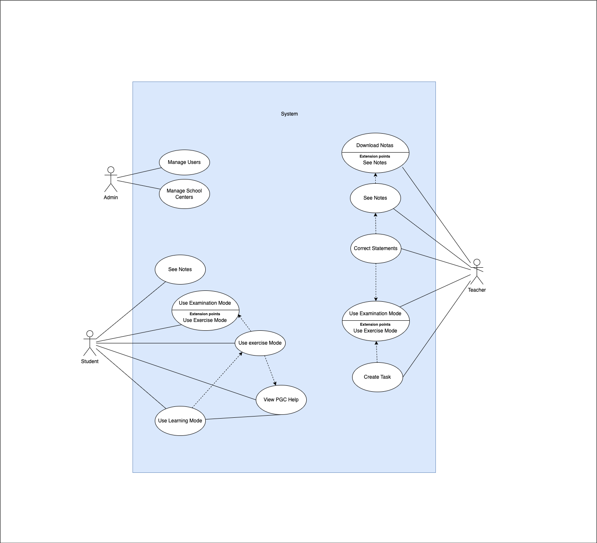
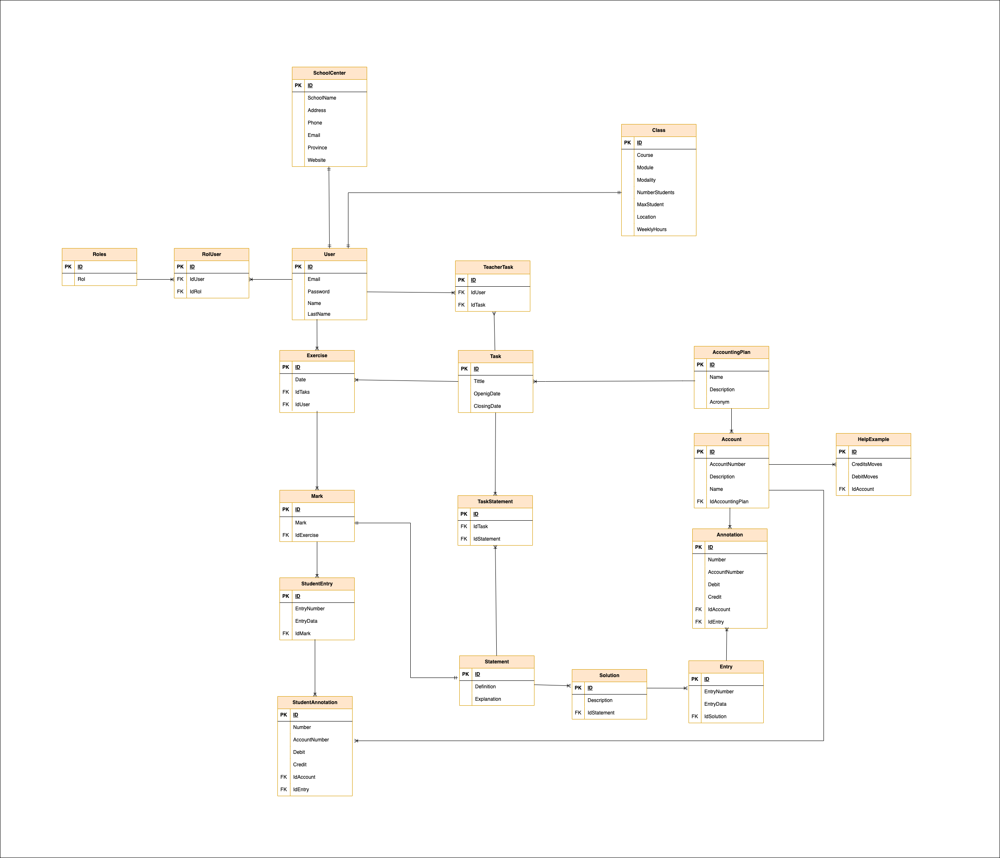

# DíaMayor Innova

<!-- -->

**DíaMayor Innova**

The project involves the development, by the students of IES El Rincón, of a cross-platform application that will assist students in the Professional Family of Administration and Management with the modules TEB, TUM, EPE, PNG, and COB in carrying out accounting entries. The application will allow the implementation of aids related to accounting accounts, as well as practical examples based on the proposed activities, which will serve as a guide and support in the learning process. The starting point is the spreadsheet created by the project coordinator. The project aims to create an application that will replace this spreadsheet, enabling its functionality on any mobile device, tablet, or PC.

## About The Project

The application to be developed aims to be an easy-to-use learning tool for both students and teachers. It should work on mobile devices, tablets, and PCs. There will be three modes of use:

Exam Mode: The student completes the task without any additional aids.
Learning Mode: A mode for learning, where aids are provided.
Exercise Mode: Similar to Exam Mode, but students can also complete it at home.
Teachers will have the ability to create statements (tasks) and also add solutions for each one. The application should automatically grade the tasks, calculating the corresponding mark. These marks will be accessible to the teachers, who can download them. Additionally, the statements created by the teachers can be set as private (only visible to the creator) or public (available for other teachers to use).

There will be three types of users with different permissions:

Administrator (Admin): Has full permissions in the application.
Teachers: Can create statements, set them as public or private, and assign tasks (a set of statements) to a group of students within a specified period. They can also view the marks of the students who have completed the tasks.
Students: In Learning Mode, they can perform tasks without these tasks being created on the platform. In Exercise Mode, they can complete tasks assigned by their teacher, view solutions, and save results. In Exam Mode, students will complete tasks without aids, similar to Exercise Mode.
The application will also manage student groups so that teachers can view and manage the tasks for each group.

Support for multiple school centers can be added, although it is not a priority, to identify which center each student and teacher belongs to.

In the Diary tab, accounting entries will be managed, which are related to the statements. A statement generally corresponds to an entry, although there may be cases where a statement involves multiple entries. Additionally, an entry may have several accounting postings, and although the order of the postings may vary, the solution remains valid. In some cases, the same statement may have more than one solution, in which case the teacher must enter all possible solutions.

In the Ledger tab, a dynamic table will be automatically generated based on the data from the Diary.

In the Trial Balance tab, the data will also be automatically calculated from the information in the Diary.

The PGC tab will be used to access the General Accounting Plan, particularly the PGC for SMEs. There will be five types of accounting plans provided in Excel format by IES Santa Brígida. Each accounting plan has five columns: account number, account definition, debit reasons, credit reasons, and the type of account (asset, liability, income, or expense). Additionally, teachers can activate or deactivate aids (examples of how to use the accounts) in this tab, and these aids will be available to students while working on the accounting entries in the Diary tab.

This set of features forms an integrated application designed to facilitate learning in accounting with support for task creation, automatic grading, and result management.

## Diagrams
### Use Case Diagram
As explained in the previous section, we visually illustrate in the following diagram all the actions that each of the roles can perform.
<div style="text-align: center; height: fit-content; margin: 20px 0">
    
</div>

### Class Diagram
<div style="text-align: center; height: fit-content; margin: 20px 0">
    
</div>

Thanks to the class diagram, we can start identifying the different entities that need to be created to create the database.

## Figma Prototype 🎨

Once we have a first idea of the application, we can start to create the prototype, to create it we have used Figma, here is the prototype. [Figma Prototype](https://www.figma.com/design/umvmGhnsnixHyXQL10bJx4/Dia-mayor?node-id=0-1&t=BXY9WzeRwVCoMg57-1)

## Getting Started 🚀

See Installation for instructions on how to deploy the project.

### Pre-requisitos 📋

* **[IDE]** - Integrated Development Environment. In our case, we used Visual Studio Code (https://code.visualstudio.com). It can be downloaded from the official website.

* **[Node]** -  A runtime environment that allows developers to run JavaScript on the server side. We can download it from the official website (https://nodejs.org/en/), it's recommended to use the LTS version.

* **[WSL2]** - Windows Subsystem for Linux 2. is a feature in Windows that allows users to run a full Linux kernel and Linux distributions directly on Windows without the need for virtual machines or dual boot setups. <!-- ¿Es un pre-requisito?, yo diría que si -->

### Installation 🔧

* We open PowerShell as administrator and run the following command to install WSL2.

```
wsl --install
```

* We will continue cloning the repository on our local machine.

```
git clone https://github.com/AlbertoGG20/DiaMayorInnova.git
```

* Open VSCode and navigate to the project folder.

```
cd DiaMayorInnova
```

* From the terminal in VSCode, we navigate to the Frontend folder, install the dependencies, and start the project.

```
cd Frontent/
npm install
npm run dev
```

* We open a terminal 'Ubuntu (WSL)' and navigate to the Backend folder, then install the dependencies.

```
cd Backend/
bundler install
```

* Once the dependencies are installed, we must create a '.env' file in our Backend with the following format inside.

```
DATABASE_USERNAME=nombre
DATABASE_PASSWORD=password
DATABASE_HOST=localhost
DATABASE_PORT=5432
```
The host and port should be 'localhost' and '5432'. The username and password should be the username and password of the local database.

* Once the '.env' file is created in our Backend, we will install the gem that allows us to use it.

```
gem install dotenv
```

* We create the database by running the following command.

```
rails db:create
```

* To run the migration for the table in our Database, we will use the following command:

```
rails db:migrate
```
This command will create the necessary tables for our application to function.

* (OPTIONAL) If we want to have test data in our table, we will execute the following command:

```
rails db:seed
```
This command will insert some records into our Database.

* Now we can start the application server:

```
rails s
```

## Running Tests ⚙️

**¡¡In progress!!**
<!-- You can access the application and use it normally.

* Accessing the application:
    - Go to localhost:5173/
    - Página de inicio

* Creating a new record:
    - Click the button in the navigation navbar located at the top right.
    - Fill out the form and add the new record.
    - If there are no errors, you will be redirected to the list of Paintings.

* Deleting a record:
    - From the list of Paintings, click the "Borrar" button.
    - The record will be removed from the list of Paintings.

**In the artistic universe, each data point has its place and meaning. Do not delete them; remember, art is an act of creation, and each element in our list is part of the story we are telling.**

* Editing an existing record:
    - From the list of Paintings, click the "Editar" button.
    - Modify the fields as desired and click "Editar Obra".
    - If there are no errors, you will be redirected to the list of Paintings. -->

## Built With 🛠️

* [ReactJS] - ReactJS is an open-source JavaScript library used for building user interfaces, particularly single-page applications. It was developed by Facebook and focuses on creating reusable components that manage their own state and update efficiently. Its main feature is the use of a Virtual DOM (Document Object Model), which optimizes UI updates without needing to reload the entire page.
* [RubyOnRails] - Ruby on Rails (or Rails) is a web development framework written in the Ruby programming language. It is designed to make building web applications faster and more efficient, emphasizing conventions over configuration and the "Don't Repeat Yourself" (DRY) principle. Rails follows the MVC (Model-View-Controller) architecture pattern and provides built-in tools to manage databases, routes, and views, allowing developers to focus more on business logic and less on repetitive details.
* [ActiveRecord] - ActiveRecord is a Ruby library that is part of the Ruby on Rails framework and is used for database management. It implements the ORM (Object-Relational Mapping) design pattern, which means it maps database tables to Ruby classes and objects.
* [PostgreSQL] - PostgreSQL is an open-source, powerful relational database management system. It is known for its high compliance with SQL standards and for offering advanced features such as ACID transactions, complex queries, support for geospatial data (through extensions like PostGIS), and the ability to handle large volumes of data. PostgreSQL is ideal for applications that require high performance and reliability, and is used in both small-scale applications and large enterprise environments.

## Autores ✒️
* **Alberto Guerrero Gutiérrez** - *Initial Work* - [AlbertoGG20](https://github.com/AlbertoGG20)
* **Juan Carlos Bolaños Ojeda** - *Initial Work* - [jcbo2425](https://github.com/jcbo2425)
* **Echedey Henríquez Hernández** - *Initial Work* - [EchedeyHenr](https://github.com/EchedeyHenr)
* **Andrés Villanueva** - *ReadMe* - [Villanuevand](https://github.com/Villanuevand)

## Licencia 📄

This project is licensed under the (Your License) - see the [LICENSE.md](LICENSE.md) file for details.

---
⌨️ with ❤️ by [AlbertoGG20](https://github.com/AlbertoGG20), [jcbo2425](https://github.com/jcbo2425), [EchedeyHenr](https://github.com/EchedeyHenr) 😊
